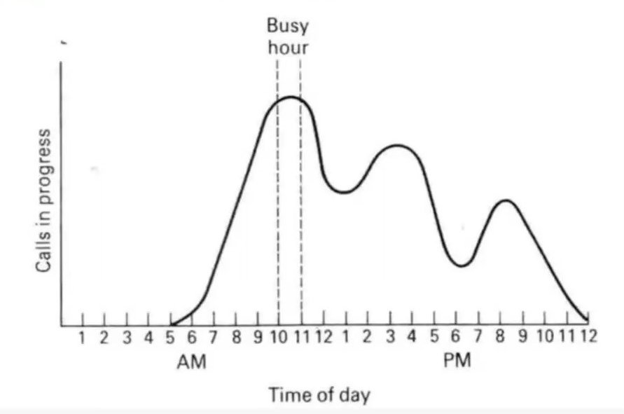

# Unit-1 Traffic Engineering And Signaling

<!-- 1. Telecommunication Traffic:
    - unit of Traffic , Traffic measurement.
    - A mathematical model:
        1. Lost call systems:
            - Theory , Traffic Performance.
            - Loss systems in tandem.
            - Traffic tables.
        2. Queueing systems: 
            - Erlang Distribution
            -Probability of delay
2. Signaling:
    - CCITT Signaling System and Digital Customers line Signaling -->

----------------------------------

## Telephone Traffic profile

1. operater thus offer cheaper call rates during off-peak hours. It costs them almost nothing to carry such calls

2. if they manage to shift some calls from peak and thus capital expenditure are needed.

An <b style="color:red">Example of Telephone Traffic Profile</b> of a service area:

## Traffic

1. the traffic intensity (Sometimes refered as simply as Traffic) is defined as the average number of calls in progress simultaneously during a particular period of time.

2. traffic intensity is a measure of the average occupancy of a server or resource during a specified period of time, normally a busy hour. It is  measured in traffic units (erlangs) and defined as the ratio of the time during which a facility is cumulatively occupied to the time this facility is available for occupancy.

## Erlang

1. It is dimensionless but name is given by Erlang(unit).
2. One Erlang (E) represents the amount of traffic carried by a trunk that is completely occupied i.e one call-hour per hour or one minute per minute.

3. Traffic carried by a group of trunks is :

## Formula

$$
Traffic= A  = \frac {C \times h}{T}
$$

where,

    - A = Traffic in Erlang 
    - C = Average number of call arrivals during time T
    - h = average call holding time 

    - 1 erlang = 36 ccs (centum call second per hour)

## Trunking Concept

!!! example "Example 1.1"

    On average during the busy hour a company makes **120 outgoing** calls of average duration **2 minuates**. It recieves **200 incoming** calls of average duration **3 minutes**.

    Find:

    1. The outgoing traffic.
    2. The incoming traffic.
    3. The total traffic.

    Ans:

    1.the outgoing traffic is $$120 \times 2/60 = 4E$$.

    2.the incoming traffic is $$200 \times 3/60 = 10E$$.

    3.the total traffic is $$4 + 10 = 14E$$

!!! note
    on average four outgoing calls are made during their average holding time of 2 minutes and ten incoming calls are recieved during their average holding time of 3 minutes **i.e if T=h, then C=A.**

## Occupancy of the truncks

A single trunkcannot carry more than one call traffic A fro a single trunk is \(\leq 1\).The traffic is fraction of an erlang equal to the average propartion of time for which the trunk is busy.This is called the **occupancy of the trunk**.

The probabilty of finding a trunk busy is equal to the proportion of the time for which the trunk is busy. Thus this **Probability = Occupancy of the Trunk**

!!! example "Exapmle 1.2"

    During the busy hour on average a customers with a single telephone line makes three calls and recieves three calls. The average call duration is 2 minutes. What is the probability that a  caller will find the line engaged.
    
    Ans:
    
    **Occupancy of line** =\((3+3) \times 2/60 = 0.2E\)
                    =**Probability of finding the line engaged**

## Congestion

1. In a telephone exchange. It is possible that all subscribers make calls simultaneously. The cost of metting the demand is **prohibitive**

2. Therefore , there is a possibility that all trunks is a group of trunks  are **Busy => Congestion**.

3. **here are 2 types of telecommunication system**:
    - **Lost Call (LC) system.**
        - In Lost calls system the will be just dropped.
    - **Delay / queueing system.**
        - In delay systems calls coming in during congestion wait in a queue until on outgoing trunk becomes free.

!!! note
    Telephone systems are normally lost call systems.

## Grade of Service(GOS)

1. The porportion of calls that is lost or delayed due to congestion is a measure of the quality of the service provided. It is called **grade of       service (GOS) B**.

2. If GOS is too large it will result in many users unable to make successfull calls and thus dissatisfied.
3. If GOS is too small , unnecessory expenditure on equipment which is rarly used is made.
4. In Practice, GOS is higer for more $$LOST-CALL-SYSTEM$$

$$
\textrm{Traffic carried} = \textrm{Traffic offered} - \textrm{Traffic lost}
$$

$$
\textrm{Grade of Service B} = \frac{\textrm{No. of calls lost}}{\textrm{No. of calls offered}}
$$

$$
\textrm{Grade of Service B} = \frac{\textrm{Traffic Lost}}{\textrm{Traffic Offered}}
$$

- proportion of the time for which congestion exists.
- probability of congestion.
- probability that a call be lost due to congestion.

!!! note
    **Traffic lost is AB & Traffic is A(1 - B)**
    where

        A = Traffic in Erlang
        B = GOS

!!! attention
    Larger the grade of service the worse is the service given.
